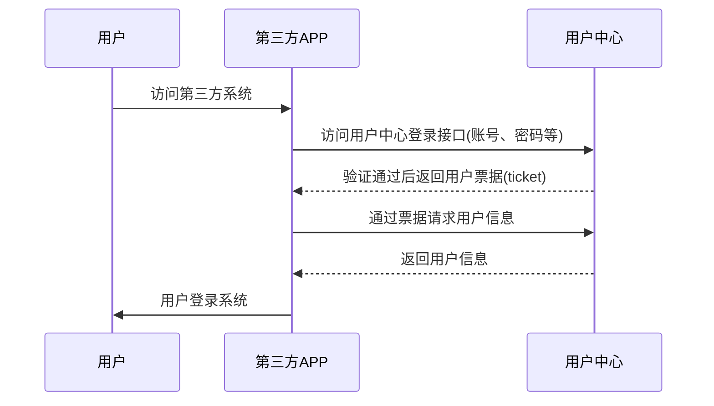
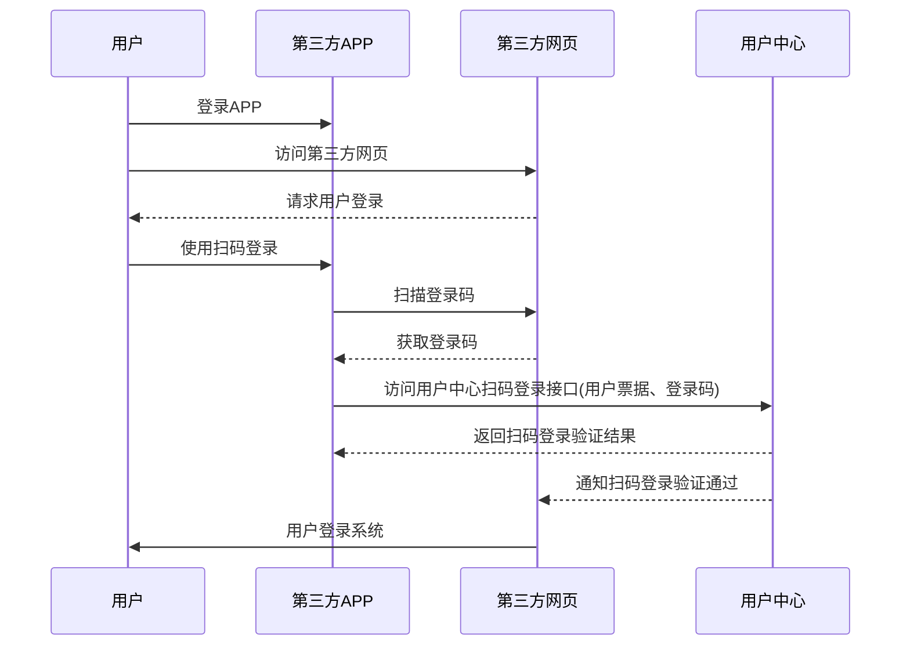
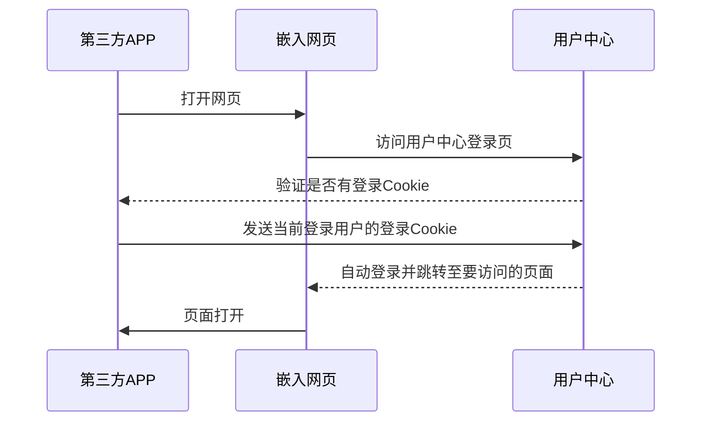

## APP授权流程说明

> APP端通过登录接口获取到用户的票据信息，再使用票据通过接口获取到登录的用户信息，并于自己系统用户关联，生成登录凭证，完成用户登录。




## 第一步：访问用户登录接口

> 使用账号密码访问用户中心登录接口，获取票据信息。

```
// HTTP POST
http://api.zhaochewisdom.com/sso/api/login
// FORM BODY
{
	"username": "username",
	"password": "password",
	"service": "http://yourweb.com/"
}
```

### 参数说明

| 参数     | 是否必须 | 说明                               |
| :------- | :------- | :--------------------------------- |
| service  | 是       | 安全域名，该地址会在用户中心备案。 |
| username | 是       | 用户账号。                         |
| password | 是       | 用户密码。                         |

### 返回说明

### 验证成功的返回结果

```
{
	"code": 0,
	"msg": "",
	"innerMsg": "",
	"results": {
		"tgt": "TGT-103-61cJqPg2uMXtdNW5Z7oc9xK8jitCxpDkURrm6A43xMpPr-BwSBXEx9JRpK5AqFUW4jA-sso-794c4fbdd6-rs8fw",
		"ticket": "ST-5880-ghVDMI4oSov2_XLHeQjvLqUFBenHPjW7a4Z6SwfwJZFRav4QGoW0Fg-sso-794c4fbdd6-rs8fw",
		"service": "http://yourweb.com/",
		"username": "username"
	}
}
```

### 参数说明

| 参数             | 说明             |
| :--------------- | :--------------- |
| results.tgt      | TGT。            |
| results.ticket   | 用户票据。       |
| results.service  | 提交的安全域名。 |
| results.username | 用户账号。       |

### 验证失败的返回结果

```
{
	"code": 400,
	"msg": "Login fail",
	"innerMsg": "INVALID_USER",
	"results": {}
}
```

### 参数说明

| 参数     | 说明           |
| :------- | :------------- |
| code     | 错误代码。     |
| msg      | 错误提示。     |
| innerMsg | 错误内部说明。 |


## 第二步：通过票据请求用户信息

> 第三方系统在接收到用户票据信息后，可以通过接口请求该票据所对应的用户信息，该操作同网页端，[跳转查看](sso/pc?id=第二步：通过票据请求用户信息)。


## 客户端扫码登录

> 用户中心网页端登录页面支持扫码登录，第三方APP客户端可以集成该功能，在APP端用户完成登录后，扫描网页端登录二维码完成网页端登录。



## 扫码登录接口

```
// HTTP POST
http://api.zhaochewisdom.com/sso/api/qrcode/login
// FORM BODY
{
	"qrcode": "qrcode",
	"tgt": "tgt"
}
```

### 参数说明

| 参数    | 是否必须 | 说明                               |
| :------ | :------- | :--------------------------------- |
| qrcode  | 是       | 扫描到的二维码信息。               |
| tgt     | 是       | 用户登录接口获取到的TGT。          |


### 返回说明

### 验证成功的返回结果

```
{
	"code": 0,
	"msg": "",
	"innerMsg": "",
	"results": true
}
```

### 参数说明

| 参数    | 说明                   |
| :------ | :--------------------- |
| results | 扫码登录验证是否通过。 |

### 验证失败的返回结果

```
{
	"code": 400,
	"msg": "QRLogin fail.",
	"innerMsg": "INVALID_USER",
	"results": false
}
```

### 参数说明

| 参数    | 说明                   |
| :------ | :--------------------- |
| results | 扫码登录验证是否通过。 |


## APP内嵌网页登录

> APP会因业务需要嵌入网页端页面，这些网页端只要与用户中心打通，那么APP只需要在WebView写入用户中心的登录验证Cookie，就能实现嵌入网页自动登录。



### Cookie格式

> domain: sso.zhaochewisdom.com
>
> path: /
>
> tgt: 用户登录接口获取到的TGT
>
> expires: 3天


### 代码示例
```swift
//
//  ScanLoginController.swift
//  sso.test
//
//  Created by Lugia on 2018/1/13.
//  Copyright © 2018年 Lugia. All rights reserved.
//

import UIKit
import Motion
import Alamofire
import SwiftyJSON

class WebShowController: UIViewController {
    @IBOutlet weak var web: UIWebView!
    
    override func viewDidLoad() {
        let url = URL(string: "嵌入的页面链接")
        let request = URLRequest(url: url!)
        addCustomerCookie(tgt:"tgt")
        web.loadRequest(request)
        super.viewDidLoad()
    }
    
    // 为url绑定cookie
    func addCustomerCookie(tgt:String) {
        let domain = "sso.zhaochewisdom.com"
        let expTime = TimeInterval(60 * 60 * 24 * 3)
        let cookieProps: [HTTPCookiePropertyKey : Any] = [
            HTTPCookiePropertyKey.domain: domain,
            HTTPCookiePropertyKey.path: "/",
            HTTPCookiePropertyKey.name: "tgt",
            HTTPCookiePropertyKey.value: tgt,
            HTTPCookiePropertyKey.expires: NSDate(timeIntervalSinceNow: expTime)
        ]
        
        if let cookie = HTTPCookie(properties: cookieProps) {
            HTTPCookieStorage.shared.setCookie(cookie)
        }
    }
    
    override func didReceiveMemoryWarning() {
        super.didReceiveMemoryWarning()
        // Dispose of any resources that can be recreated.
    }
    
    @IBAction func btnBack(_ sender: Any) {
        self.dismiss(animated: true, completion: nil)
    }
}
```


## 用户凭证超时刷新

!> 用户登录后获取到的凭证有效时间为3天，当用户凭证失效后，客户端可通过[登录接口](sso/app?id=第一步：访问用户登录接口)重新获取凭证。