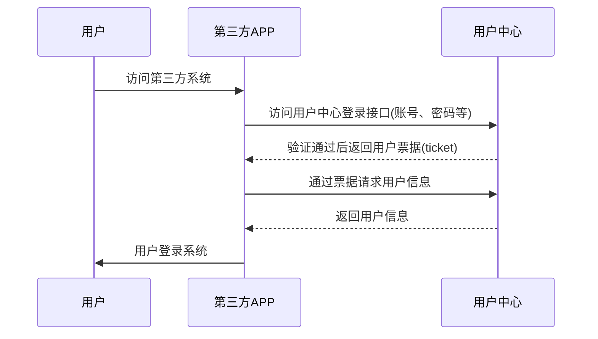

## APP授权流程说明

> APP端通过登录接口获取到用户的票据信息，再使用票据通过接口获取到登录的用户信息，并于自己系统用户关联，生成登录凭证，完成用户登录。



## 第一步：访问用户登录接口

> 使用账号密码访问用户中心登录接口，获取票据信息。

```
// HTTP POST
http://sso.zhaochewisdom.com/api/login
// FORM BODY
{
	"username": "username",
	"password": "password",
	"service": "http://yourweb.com/"
}
```

### 参数说明

| 参数     | 是否必须 | 说明                               |
| :------- | :------- | :--------------------------------- |
| service  | 是       | 安全域名，该地址会再用户中心备案。 |
| username | 是       | 用户账号。                         |
| password | 是       | 用户密码。                         |

### 返回说明

### 验证成功的返回结果

```
{
	"code": 0,
	"msg": "",
	"innerMsg": "",
	"results": {
		"tgt": "TGT-103-61cJqPg2uMXtdNW5Z7oc9xK8jitCxpDkURrm6A43xMpPr-BwSBXEx9JRpK5AqFUW4jA-sso-794c4fbdd6-rs8fw",
		"ticket": "ST-5880-ghVDMI4oSov2_XLHeQjvLqUFBenHPjW7a4Z6SwfwJZFRav4QGoW0Fg-sso-794c4fbdd6-rs8fw",
		"service": "http://yourweb.com/",
		"username": "username"
	}
}
```

### 参数说明

| 参数             | 说明             |
| :--------------- | :--------------- |
| results.tgt      | TGT。            |
| results.ticket   | 用户票据。       |
| results.service  | 提交的安全域名。 |
| results.username | 用户账号。       |

### 验证失败的返回结果

```
{
	"code": 0,
	"msg": "",
	"innerMsg": "",
	"results": {
		"authenticationFailure": {
			"code": "INVALID_USER",
			"description": "Login fail."
		}
	}
}
```

### 参数说明

| 参数                                                | 说明                 |
| :-------------------------------------------------- | :------------------- |
| serviceResponse. authenticationFailure              | 验证失败的返回对象。 |
| serviceResponse. authenticationFailure. code        | 错误代码。           |
| serviceResponse. authenticationFailure. description | 错误说明。           |


## 第二步：通过票据请求用户信息

> 第三方系统在接收到用户票据信息后，可以通过接口请求该票据所对应的用户信息，该操作同网页端，[跳转查看](sso/pc?id=第二步：通过票据请求用户信息)。

