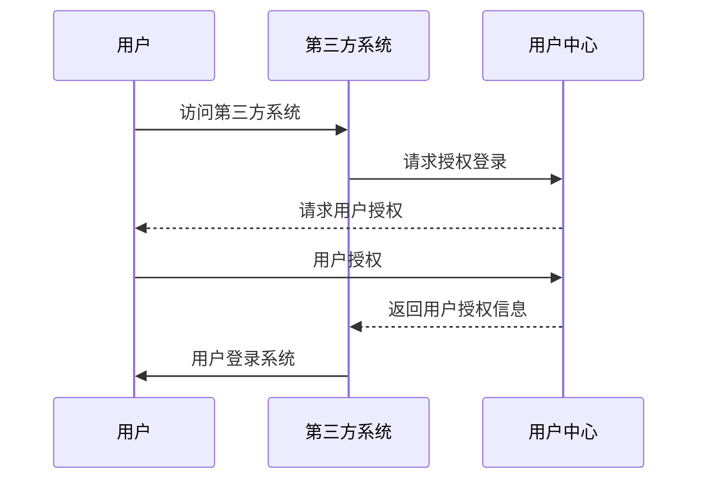

## 什么是用户中心

用户中心统一管理分发所有用户账户信息，接入的第三方系统可以快速与现有用户体系打通，系统支持网页端和APP端接入，并客通过WebHook来同步用户数据。

## 接入步骤

1. 编写接口对接WebHook来同步用户数据。
2. 编写统一注销接口。
3. 客户端对接。

## 什么是WebHook

> 用户中心会通过WebHook向第三方系统分发可以登录该系统的用户数据，第三方系统需要根据自身系统需要存储在自身系统的用户表中，用户授权登录后，根据用户中心的用户编号与自身系统中的用户关联并完成登录操作。

!> 注意！用户中心只单向分发数据，不会接受第三方系统的数据回传。并且不会分发用户密码信息。

## 为什么要同步用户数据

> 不通系统之间用户信息属性字段各不相同，并且模型、纬度、存储方式也都不一，用户中心只会分发用户基本信息，第三方系统需要自行转换和保存，其他非标准数据仍然在各个系统自身平台维护。

## 用户登录授权流程

