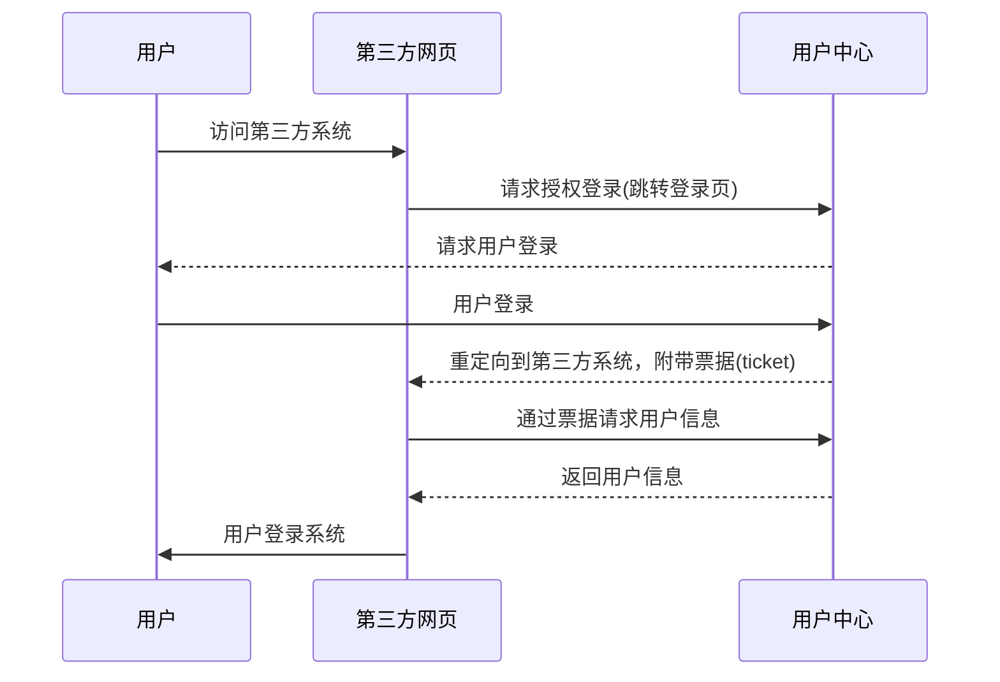
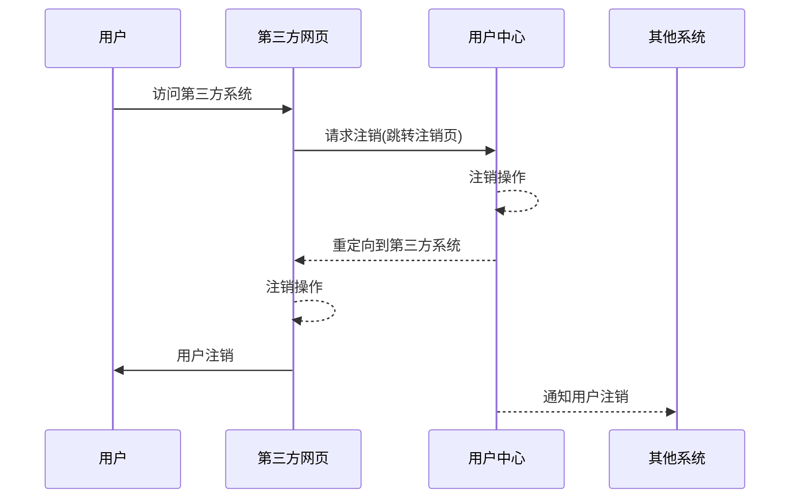

## 网页授权流程说明

> 用户在访问第三方系统时，第三方系统判断用户是否已经在自己系统登录，如果没有则跳转至用户中心登录页面，用户授权登录后，系统会跳转会第三方系统并附带票据信息，第三方系统使用票据通过接口获取到登录的用户信息，并于自己系统用户关联，生成登录凭证，完成用户登录。




## 第一步：请求授权登录(跳转登录页)

> 第三方系统跳转至用户中心登录页，并附带service和state参数。

```
// HTTP GET
http://sso.zhaochewisdom.com/login?service=http://yourweb.com/loginBySSO&state=/index.html
```

### 参数说明

| 参数    | 是否必须 | 说明                                                         |
| :------ | :------- | :----------------------------------------------------------- |
| service | 是       | 用户登录成功后跳转回第三方系统的URL地址。<br />该地址会在用户中心备案，并会有验证。 |
| state   | 否       | 第三方系统附带参数，该参数会被传递至service所定义的URL地址，<br />用于第三方系统传递数据使用。 |

!> 注意！如果state参数是带有参数的URL地址，需要两次encode处理。

```
state = "/index.html?param=value" //没有encode前
state = "%252Findex.html%253Fparam%253Dvalue" //两次encode后
```

### 返回说明

> 用户登录成功后，将会重定向到service的网址上，并且带上ticket和state参数。

```
http://yourweb.com/loginBySSO?ticket=ST-5864-EqLV2DUJjN2S8uq0ZIlbhGuWx3VZ10YQ0SrEnV19yvN5sODNc4AaCA-sso-794c4fbdd6-rs8fw&state=/index.html
```


## 第二步：通过票据请求用户信息

> 第三方系统在接收到用户票据信息后，可以通过接口请求该票据所对应的用户信息。

```
// HTTP GET
http://sso.zhaochewisdom.com/serviceValidate?service=http://yourweb.com/loginBySSO&ticket=ST-5864-EqLV2DUJjN2S8uq0ZIlbhGuWx3VZ10YQ0SrEnV19yvN5sODNc4AaCA-sso-794c4fbdd6-rs8fw
```

### 参数说明

| 参数    | 是否必须 | 说明                              |
| :------ | :------- | :-------------------------------- |
| service | 是       | 请求授权登录时传递的service参数。 |
| ticket  | 是       | 用户票据。                        |

### 返回说明

### 验证成功的返回结果
```
{
	"code": 0,
	"msg": "",
	"innerMsg": "",
	"results": {
		"ssoid": "27712164270902987004601033215261"
	}
}
```

### 参数说明

| 参数          | 说明                                             |
| :------------ | :----------------------------------------------- |
| results.ssoid | 用户编号，使用此编号关联自己系统中所对应的用户。 |


### 验证失败的返回结果
```
{
    "code": 400,
    "msg": "Ticket 'ST-5864-EqLV2DUJjN2S8uq0ZIlbhGuWx3VZ10YQ0SrEnV19yvN5sODNc4AaCA-sso-794c4fbdd6-rs8fw' not recognized",
    "innerMsg": "INVALID_TICKET",
    "results": {}
}
```
### 参数说明

| 参数     | 说明           |
| :------- | :------------- |
| code     | 错误代码。     |
| msg      | 错误提示。     |
| innerMsg | 错误内部说明。 |


## 用户注销

> 当用户需要注销登录时，第三方系统在接收到注销操作指令后跳转页面至用户中心的注销页面，用户中心会完成注销操作，并分发注销通知至其他系统，实现统一注销操作。
> 
> 注意！网页端注销操作需要实现两步：
> 1. 用户请求注销操作后，跳转至用户中心注销页面。
> 2. 实现注销接口，当用户在其他系统注销操作时，用户中心会通知该接口。




## 第一步：请求注销(跳转注销页)

> 第三方系统跳转至用户中心注销页，并附带service和state参数。

```
// HTTP GET
http://sso.zhaochewisdom.com/logoutBySSO?service=http://yourweb.com/logout&state=/index.html
```

### 参数说明

| 参数    | 是否必须 | 说明                                                         |
| :------ | :------- | :----------------------------------------------------------- |
| service | 是       | 用户注销后跳转回第三方系统的URL地址。<br />该地址会在用户中心备案，并会有验证。 |
| state   | 否       | 第三方系统附带参数，该参数会被传递至service所定义的URL地址，<br />用于第三方系统传递数据使用。 |

!> 注意！如果state参数是带有参数的URL地址，需要两次encode处理。

```
state = "/index.html?param=value" //没有encode前
state = "%252Findex.html%253Fparam%253Dvalue" //两次encode后
```

### 返回说明

> 用户注销成功后，将会重定向到service的网址上，并且带上state参数。

```
http://yourweb.com/logoutBySSO?state=/index.html
```


## 第二步：实现用户注销接口

> 当其他系统用户注销时，用户中心会分发注销消息至所有涉及的系统，实用用户统一注销。
>
> 第三方系统需要提前在用户中心设置注销接口地址。

```
// 注销消息
// HTTP POST
{
	"ssoid": "27712164270902987004601033215261"
}
```

### 参数说明

| 参数  | 是否必须 | 说明                                             |
| :---- | :------- | :----------------------------------------------- |
| ssoid | 是       | 用户编号，使用此编号关联自己系统中所对应的用户。 |

### 返回说明

!> 用户中心暂不会对注销消息返回结果做任何处理，也不会有重试处理。


