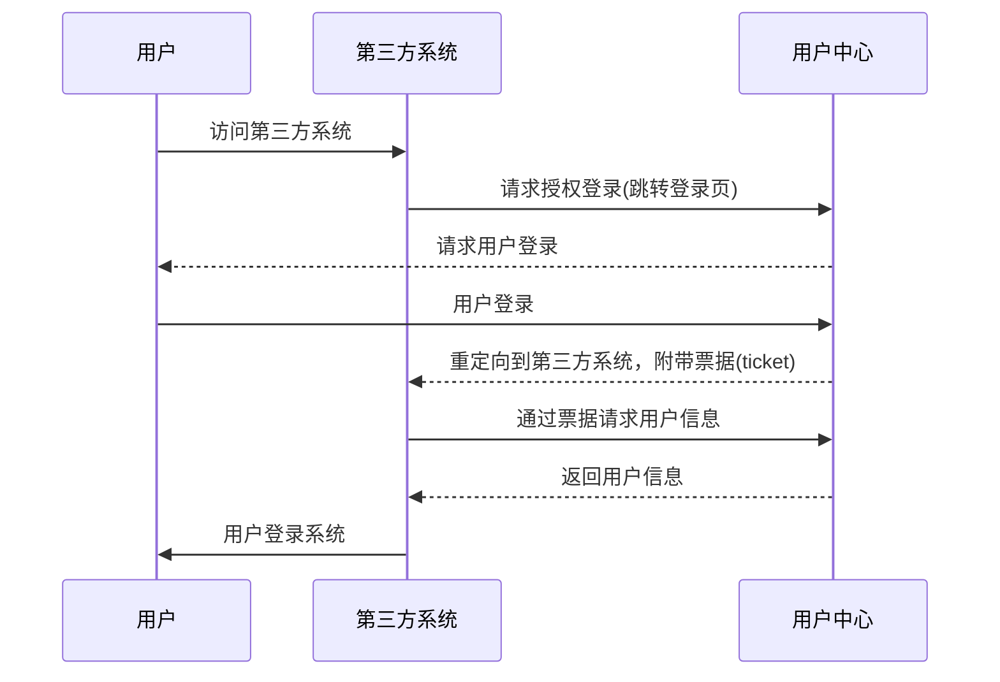

## 接入流程

```mermaid
%% Example of sequence diagram
  sequenceDiagram
    用户->>第三方系统: 访问第三方系统
    第三方系统->>用户中心: 请求授权登录(跳转登录页)
    用户中心-->>用户: 请求用户登录
    用户->>用户中心: 用户登录
    用户中心-->>第三方系统: 重定向到第三方系统，附带票据(ticket)
    第三方系统->>用户中心: 通过票据请求用户信息
    用户中心-->>第三方系统: 返回用户信息
    第三方系统->>用户: 用户登录系统
```