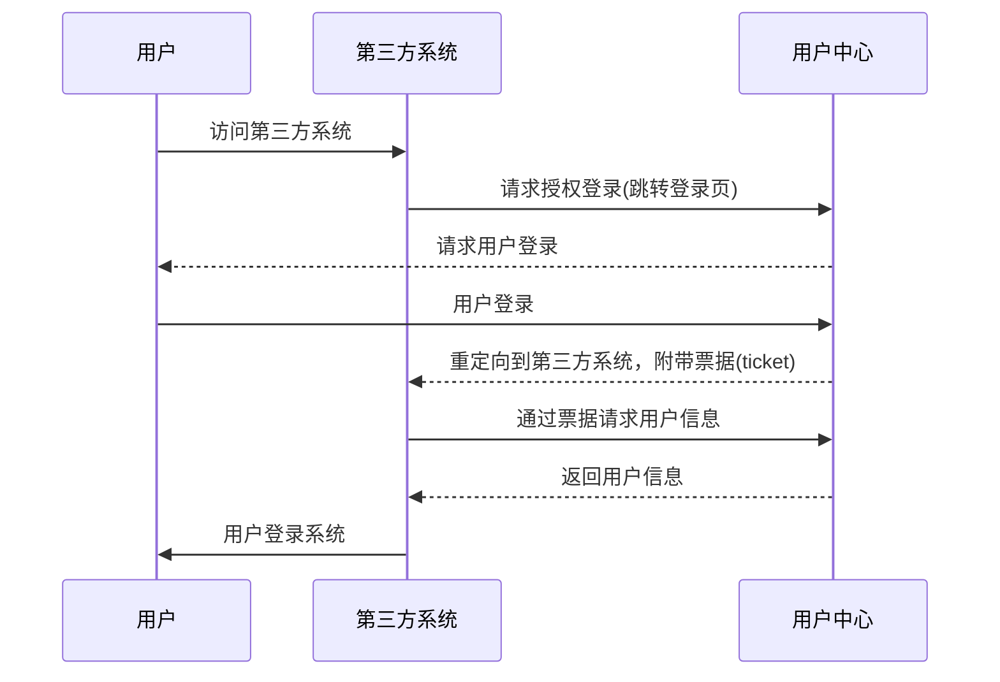

## 授权流程说明

用户在访问第三方系统时，第三方系统判断用户是否已经在自己系统登录，如果没有则跳转至用户中心登录页面，用户授权登录后，系统会跳转会第三方系统并附带票据信息，第三方系统使用票据通过接口获取到登录的用户信息，并于自己系统用户关联，生成登录凭证，完成用户登录。

```mermaid
%% Example of sequence diagram
  sequenceDiagram
    用户->>第三方系统: 访问第三方系统
    第三方系统->>用户中心: 请求授权登录(跳转登录页)
    用户中心-->>用户: 请求用户登录
    用户->>用户中心: 用户登录
    用户中心-->>第三方系统: 重定向到第三方系统，附带票据(ticket)
    第三方系统->>用户中心: 通过票据请求用户信息
    用户中心-->>第三方系统: 返回用户信息
    第三方系统->>用户: 用户登录系统
```

##请求授权登录(跳转登录页)

##通过票据请求用户信息